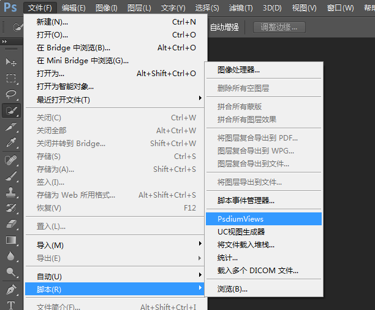

Psdium-Views
============

## 什么是 Psdium-Views ?

一个通过解析 psd 文件生成各类游戏视图的工具。
设计师需提供2类 psd 文件，
一类为切片 psd 文件，用于生成图片资源，存放在指定目录。
一类为场景 psd 文件，用于最终生成游戏场景，存放在指定目录。

## 用到哪些工具 ?

+ 利用 cs 提供的 extendscript 脚本语言编写

## 使用前需要准备什么 ?

安装 cs6

## 如何使用?

### 1.找到文件 Psdium-Views/production/PsdiumViews.jsx

2.进入文件找到以下代码段

>     PV.Config = (function() {
>         return {
>             DEBUG: true,
>     
>             LIB_MODE: {
>             	QUARKJS: {
>                     SOURCE_PATH: {
>                         SLICE: "/d/Github/Psdium-Views/demo/ui_slice/",
>                         POS: "/d/Github/Psdium-Views/demo/ui_pos/"
>                     },
>                     EXPORT_PATH: {
>                         SLICE: "/d/Github/Psdium-Views/demo/r_d_slice/",
>                         POS: "/d/Github/Psdium-Views/demo/r_d_pos/",
>                         IMAGE: "/d/Github/Psdium-Views/demo/r_d_images/"
>                     }
>                 }
>             }
>         }
>     })();

+ 配置切片 psd 文件路径（运行时工具将到该目录下找对应的切片类 psd 文件）eg:
>     SLICE: "/d/Github/Psdium-Views/demo/ui_slice/"

+ 配置对文 psd 文件路径（运行时工具将到该目录下找对应的场景类 psd 文件）eg:
>     POS: "/d/Github/Psdium-Views/demo/ui_pos/"

+ 配置切片文件路径（运行后切片文件将存放于该路径下）eg:
>     SLICE: "/d/Github/Psdium-Views/demo/r_d_slice/"

+ 配置场景文件路径（运行后场景文件将存放于该路径下）eg:
>     POS: "/d/Github/Psdium-Views/demo/r_d_pos/"

+ 配置图片资源生成路径（运行后图片资源将存放于该路径下）eg:
>     IMAGE: "/d/Github/Psdium-Views/demo/r_d_images/"

3.将 PsdiumViews.jsx 文件复制到 cs6 脚本目录下。

+ 找到目录：$(CS6目录)\Presets\Scripts  eg：
>    C:\Program Files\Adobe\Adobe Photoshop CS6 (64 Bit)\Presets\Scripts

4.打开 cs6，文件->脚本->PsdiumViews,点击运行即可。

power by uc游戏大厅.